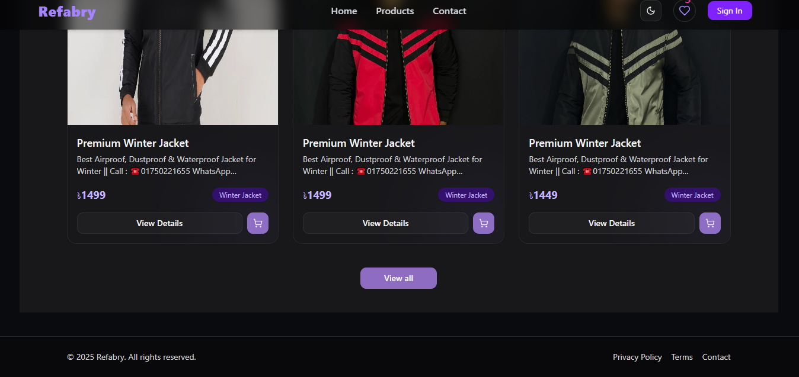

🛍️ E-Commerce Store - Modern Redux & Next.js
Project Screenshot

🌟 Features
Product Browsing: View all available products with details

Shopping Cart: Add/remove items and adjust quantities

Smart Calculations: Automatic cart total and tax calculations

Dark/Light Mode: Toggle between dark and light themes

Responsive Design: Works on all device sizes

Type Safety: Built with TypeScript for better developer experience

🚀 Live Demo
Check out the live version here: https://yourecommerce.com
(Replace with your actual live link)

🛠️ Technologies Used
Frontend: Next.js (React)

State Management: Redux Toolkit

Type Safety: TypeScript

Styling: (CSS Modules/Tailwind/Styled Components - specify which you use)

Build Tool: Vite/Webpack (specify if relevant)

📦 Installation
Clone the repository:

bash
git clone https://github.com/yourusername/ecommerce-store.git
Install dependencies:

bash
npm install

# or

yarn install
Set up environment variables (create .env.local file):

env
NEXT_PUBLIC_API_URL=your_api_url

# Add other environment variables as needed

Run the development server:

bash
npm run dev

# or

yarn dev
